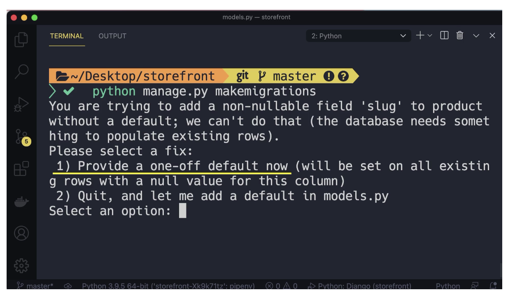
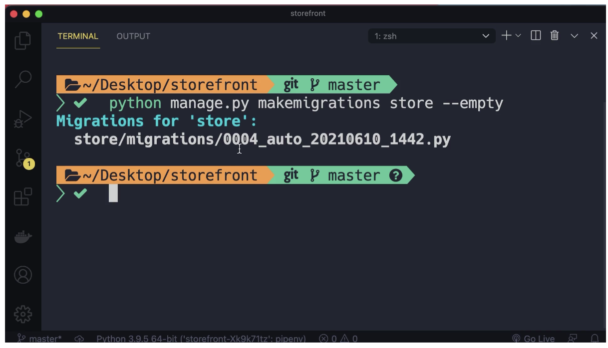

# 1-storefront

## Add toolbar in Django
> Django debug toolbar

```bash
python -m pip install django-debug-toolbar
```

[https://django-debug-toolbar.readthedocs.io/en/latest/installation.html](https://django-debug-toolbar.readthedocs.io/en/latest/installation.html)

---
# 2- Models

> Building an e-commerce data model
- relation btw products with collection
- <br>

- relation btw products ,cart,cartitem

- <br>

- relation btw products , orders, orderItem ,customer
- <br>
- relation btw products and tag
- <br>

<br>
<br>

> Organizing Models in Apps
>> <br>

> Let's create a 2 django
app

```bash
python manage.py startapp store
python manage.py startapp tags
```


> Creating Models
[https://docs.djangoproject.com/en/4.1/ref/models/fields/](https://docs.djangoproject.com/en/4.1/ref/models/fields/)
<br>

> - one_to_one
> - one_to_many
> - Circular dependency

Model file for store app
store-[model.py](1-storefront/store/models.py)


> - Generic Relationships
>
<mark>pending<mark>

Model file for tags app
tags-[model.py](1-storefront/tags/models.py)

---

# DataBase
`create migrations,running migration,reversiong mirgartions
,pupulation the database`

> - create mirgration
```bash
python manage.py makemigrations
```
all migrations created on migration folder -->
inner your store-app folder

>> create migration for spacific `app`
```bash
python manage.py makemigrations <app-name(store)>
```

imported notes:



> - Running migrations

```bash
python manage.py migrate
```

> <mark> sqlmigrate <mark>

- if you want to see the sql queries of your migration on the time of creation

```bash
python manage.py sqlmigrate
```

```bash
python manage.py sqlmigrate <app_name>
```


```bash
python manage.py sqlmigrate <app_name> <spacific migration (0003)>
```


> customizing database schema

- change table name in database or much more
[django model metadata](https://docs.djangoproject.com/en/4.1/ref/models/options/)

- to change table name we need to go
`models.py`
```python
# add
class Meta:
  db_table='store_new_customer'

```
or you can add much more
```python
# add
class Meta:
  db_table='store_new_customer'
  indexes =[
    models.Index(fields=['last_name','first_name'])
  ]
```


> - Reverting Migrations

find migrations folder --> and inside of them delete last migration .py(like last file is 0004_smedfdfa.py) file
And run
```bash
python manage.py migration store(app-name) 0003(2nd-last-file-number)
```

<mark>but there as an issue<mark>

we deleted only migration file but the code change is still remaining that's why we `use git for this `

<mark> use git reset for reverting migrations <mark>
```gitbash
git reset --hard HEAD~1
```

UTC
> Running Custom SQL





> Generating Dummy Data<br>
[www.mockaroo.com/](https://www.mockaroo.com/)


---

# Django ORM (Object-relational Mappers)
~~sql='SELECT * FROM product~~
products= Product.objects.all()

benifits:
- Reduce complexity in code
- Make the code more understandable
- Help us get more done in less time

The best code is no code
,A good software engineer delivers working software in time


